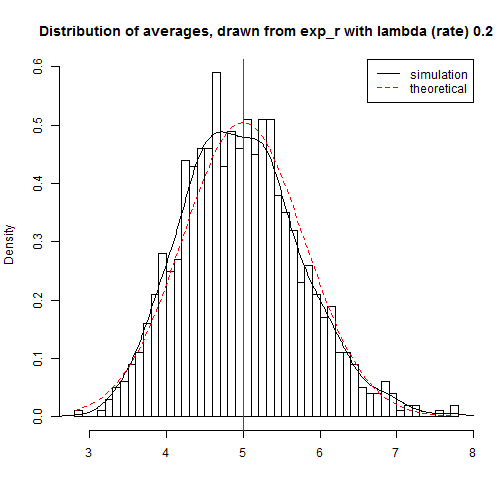
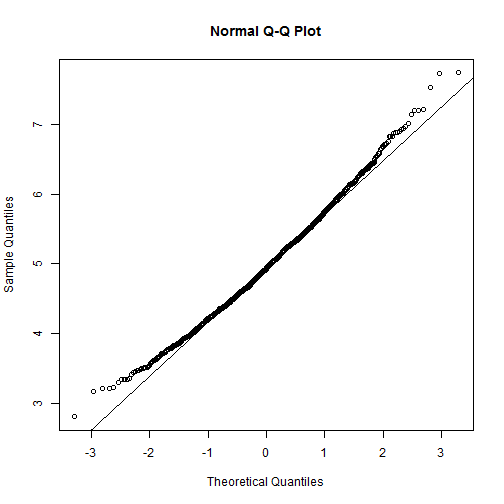
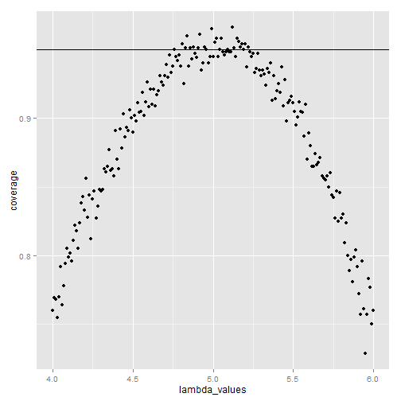

# Statistical Inference Project Part 1 (Simulation)
## author: Robert Nield

We will be simulating the exponential distribution in R with `rexp(n, rate)` (from the documentation rexp(n, rate = 1)). The rate will be signified by $\lambda.

* $1/\lambda$ is the mean of the expoential distribution.
* The standard deviation is $1/\lambda$. 

### Simulation:
we set $\lambda$ (the rate) to 0.2. 
In this simulation, will take the averages of 40 numbuers sampled from the distribution.
We will do 1000 simulated averages of the 40 exponentials.


```r
set.seed(1234)
lambda <- 0.2
number_of_simulation <- 1000
size_of_sample <- 40

# Create the simluation
sim <- matrix(rexp(number_of_simulation*size_of_sample, rate=lambda), number_of_simulation, size_of_sample)

#now take an average of the simluations
row_avgs <- rowMeans(sim)
```

### Now we will plot the sample means


```r
# plot the histogram of averages
hist(row_avgs, breaks=50, prob=TRUE,
     main="Distribution of averages, drawn from exp_r with lambda (rate) 0.2", xlab="")

# Now we will add the density
lines(density(row_avgs))


# plot the theoretical center of distribution
abline(v=1/lambda, col="red")

# plot theoretical density of the averages of samples
xfit <- seq(min(row_avgs), max(row_avgs), length=100)

yfit <- dnorm(xfit, mean=1/lambda, sd=(1/lambda/sqrt(size_of_sample)))

lines(xfit, yfit, pch=22, col="red", lty=2)
# Place legend on the screen
legend('topright', c("simulation", "theoretical"), lty=c(1,2), col=c("black", "red"))
```

 

* The sample means is centered at 4.9742388
* The theoretical center of the distribution is $\lambda^{-1}$ = 5.


* The variance of sample means is 0.5949702
* The theoretical variance is $\sigma^2 / n = 1/(\lambda^2 n) = 1/(0.04 \times 40)$ =
0.625.

** We can use the central limit therom to find the averages.


## We will not look at normality.


```r
qqnorm(row_avgs) 
qqline(row_avgs)
```

 

## We will then look at the coverage of the confidence interval for
$1/\lambda = \bar{X} \pm 1.96 \frac{S}{\sqrt{n}}$


```r
lambda_values <- seq(4, 6, by=0.01)

## Find coverage using sapply from the lamda_values
coverage <- sapply(lambda_values, function(lamb) {
    mu_h <- rowMeans(matrix(rexp(size_of_sample*number_of_simulation, rate=0.2),
                            number_of_simulation, size_of_sample))
    
    ul <- mu_h + qnorm(0.975) * sqrt(1/lambda**2/size_of_sample)
    
    ll <- mu_h - qnorm(0.975) * sqrt(1/lambda**2/size_of_sample)
    
    mean(ll < lamb & ul > lamb)
})

library(ggplot2)
qplot(lambda_values, coverage) + geom_hline(yintercept=0.95)
```

 

## Summary
* The 95% confidence intervals for the rate parameter ($\lambda$) to be estimated
($\hat{\lambda}$) are
$\hat{\lambda}_{low} = \hat{\lambda}(1 - \frac{1.96}{\sqrt{n}})$ agnd
$\hat{\lambda}_{upp} = \hat{\lambda}(1 + \frac{1.96}{\sqrt{n}})$.

* For selection of $\hat{\lambda}$ around 5, the average of the sample mean falls within the confidence interval at least 95% of the time.

* The true rate, $\lambda$ is 5.
